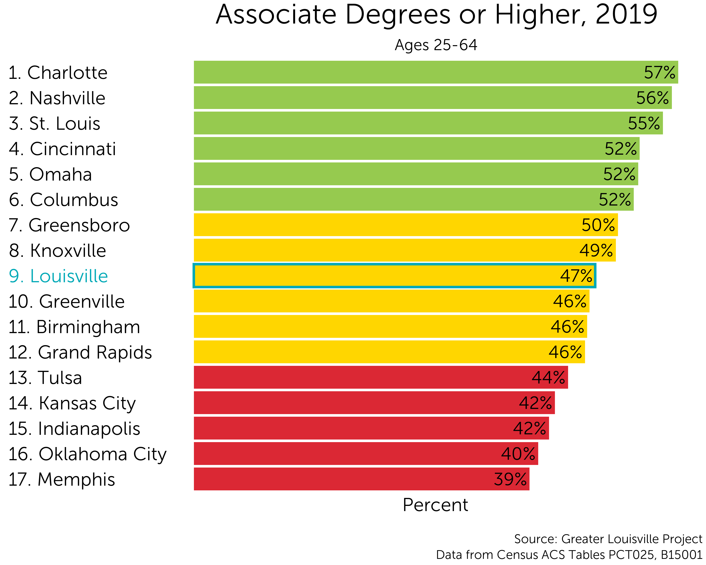
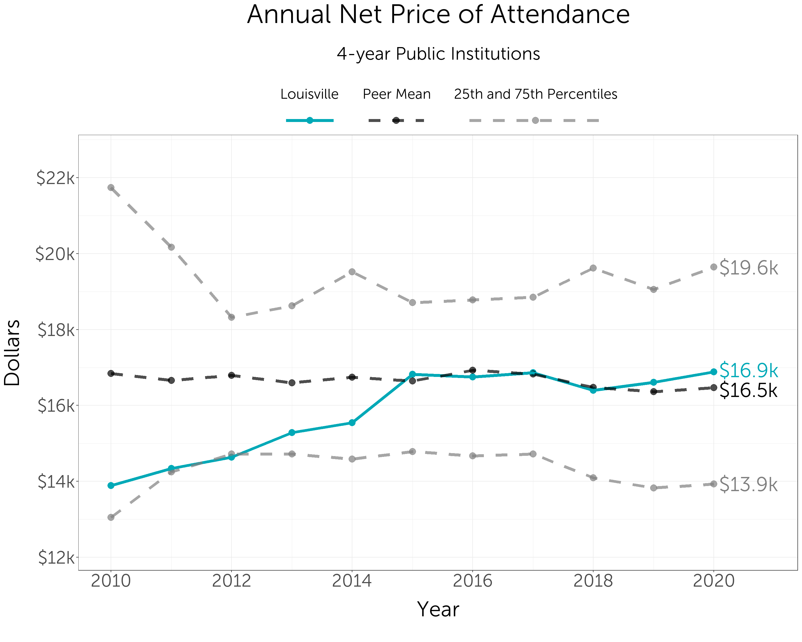

```{r setup, include=FALSE}
knitr::opts_chunk$set(echo = FALSE)
```

# Introduction

From 2010 to 2020, the 55,000 Degrees partnership led efforts to help Louisville’s residents earn tens of thousands of postsecondary degrees. While 55,000 Degrees is no longer in operation, its mission lives on through a culture of learning through data and of collaborating across sectors. This report explores some of the changes to Louisville's postsecondary system going back to 55,000 Degrees' founding in 2008 with a particular focus on what has changed over the last two years.

# Community College Attainment

While 55K did not ultimately meet its ten-year attainment goal of adding 55,000 new degrees, Louisville can celebrate having added nearly 40,000 degrees (31K+ bachelor’s degrees and 8K+ associate’s degrees). As of 2020, 46% of Louisvillians now hold a degree, which is a nearly 8 point increase since 2008. Louisville has moved up one rank in degree attainment in the last decade compared to peer cities. 



# College Transition Indicators

## JCPS College-Going

College-going among JCPS students has fallen significantly over the past 13 years. In 2008, approximately 2/3 of JCPS students went directly from high school to college, while in 2021, less than half of JCPS students went directly to college.

This decline should be considered in two parts: a steady decline from 67% in 2008 to 54% 2019, followed by a steep decline to 45% in 2021 over the same time period as the COVID-19 pandemic.

From 2008 to 2019, JCPS high schools saw a steady decline in college-going from 67% to 54%. Over roughly the same time period, [national college-going rates remained fairly steady between 66% and 70%.](https://nces.ed.gov/programs/coe/indicator/cpa)

However, in 2020, the JCPS college-going rate dropped precipitously from 54% in 2019 to 48% in 2020 and again to 45% in 2021. This is in line with national declines in college-going. According to research from the National Student Clearinghouse, ["The rates at which the class of 2020 immediately enrolled in college have fallen by unprecedented levels, 4 to 10 percentage point drops depending on high school categories, with disproportionately large drops among high-poverty or low-income high schools."](https://nscresearchcenter.org/wp-content/uploads/2021_HSBenchmarksReport.pdf) 

While we do not have similar direct data on college-going for 2021, we do know that undergraduate institutions [saw continuing declines in enrollment](https://nscresearchcenter.org/stay-informed/) of roughly 3.5%, suggesting that the decline in the JCPS college-going rate from 2020 to 2021 was again in line with national trends.

<div class='tableauPlaceholder' id='viz1655134755659' style='position: relative'><noscript><a href='#'></a></noscript><object class='tableauViz'  style='display:none;'><param name='host_url' value='https%3A%2F%2Fpublic.tableau.com%2F' /> <param name='embed_code_version' value='3' /> <param name='site_root' value='' /><param name='name' value='CollegeGoingforJCPS&#47;JeffersonCountyPublicSchoolCollegeGoing' /><param name='tabs' value='no' /><param name='toolbar' value='yes' /><param name='static_image' value='https:&#47;&#47;public.tableau.com&#47;static&#47;images&#47;Co&#47;CollegeGoingforJCPS&#47;JeffersonCountyPublicSchoolCollegeGoing&#47;1.png' /> <param name='animate_transition' value='yes' /><param name='display_static_image' value='yes' /><param name='display_spinner' value='yes' /><param name='display_overlay' value='yes' /><param name='display_count' value='yes' /><param name='language' value='en-US' /></object></div>                       


```{js, embed1}
var divElement = document.getElementById('viz1655298010036');                    
var vizElement = divElement.getElementsByTagName('object')[0];                    
vizElement.style.width='100%';
vizElement.style.height=(divElement.offsetWidth*0.75)+'px';                 
var scriptElement = document.createElement('script');                    
scriptElement.src = 'https://public.tableau.com/javascripts/api/viz_v1.js';                    
vizElement.parentNode.insertBefore(scriptElement, vizElement);               
```

## Summer Melt

Summer melt is the percentage of students who file a Free Application for Federal Student Aid (FAFSA) but do not enroll in college within 12 months of high school graduation. It is an indicator of the number of students who have an interest in attending college but who, for various reasons, do not enroll.

Since 2008, there has been a large increase in summer melt. While the rapid increase in earlier years was likely a result of more students filling out the FAFSA, the increase over the last five years aligns with other data that show declining college-going among JCPS students.

<div class='tableauPlaceholder' id='viz1655916789208' style='position: relative'><noscript><a href='#'></a></noscript><object class='tableauViz'  style='display:none;'><param name='host_url' value='https%3A%2F%2Fpublic.tableau.com%2F' /> <param name='embed_code_version' value='3' /> <param name='site_root' value='' /><param name='name' value='2015-10-09SummerMelt_16559166820990&#47;Dashboard1' /><param name='tabs' value='no' /><param name='toolbar' value='yes' /><param name='static_image' value='https:&#47;&#47;public.tableau.com&#47;static&#47;images&#47;20&#47;2015-10-09SummerMelt_16559166820990&#47;Dashboard1&#47;1.png' /> <param name='animate_transition' value='yes' /><param name='display_static_image' value='yes' /><param name='display_spinner' value='yes' /><param name='display_overlay' value='yes' /><param name='display_count' value='yes' /><param name='language' value='en-US' /><param name='filter' value='publish=yes' /></object></div>            


```{js, embed2}
var divElement = document.getElementById('viz1655916789208');                    
var vizElement = divElement.getElementsByTagName('object')[0];                    
vizElement.style.width='100%';
vizElement.style.height=(divElement.offsetWidth*0.75)+'px';                     
var scriptElement = document.createElement('script');                    
scriptElement.src = 'https://public.tableau.com/javascripts/api/viz_v1.js';                    
vizElement.parentNode.insertBefore(scriptElement, vizElement);  
```

# Postsecondary Indicators

Since 2010, Louisville has seen declining college enrollment, but local postsecondary institutions have managed to increase their retention and graduation rates. As a result, fewer students are enrolled in local institutions, but more are graduating. 

## Undergraduate Enrollment

Undergraduate enrollment is the number of students enrolled for credit in a degree- or certificate-granting program. Total enrollment declined from 2010 to 2018, but has remained around 50,000 students over the last couple of years for which we have data.

<div class='tableauPlaceholder' id='viz1655231401440' style='position: relative'><noscript><a href='https:&#47;&#47;greaterlouisvilleproject.org&#47;'></a></noscript><object class='tableauViz'  style='display:none;'><param name='host_url' value='https%3A%2F%2Fpublic.tableau.com%2F' /> <param name='embed_code_version' value='3' /> <param name='site_root' value='' /><param name='name' value='JeffersonCountyAreaCollegeEnrollment&#47;UndergraduateEnrollment' /><param name='tabs' value='no' /><param name='toolbar' value='yes' /><param name='static_image' value='https:&#47;&#47;public.tableau.com&#47;static&#47;images&#47;Je&#47;JeffersonCountyAreaCollegeEnrollment&#47;UndergraduateEnrollment&#47;1.png' /> <param name='animate_transition' value='yes' /><param name='display_static_image' value='yes' /><param name='display_spinner' value='yes' /><param name='display_overlay' value='yes' /><param name='display_count' value='yes' /><param name='language' value='en' /></object></div>


```{js}
var divElement = document.getElementById('viz1655298010036');                    
var vizElement = divElement.getElementsByTagName('object')[0];                    
vizElement.style.width='100%';
vizElement.style.height=(divElement.offsetWidth*0.75)+'px';                 
var scriptElement = document.createElement('script');                    
scriptElement.src = 'https://public.tableau.com/javascripts/api/viz_v1.js';                    
vizElement.parentNode.insertBefore(scriptElement, vizElement); 
```


## Degree Completions

Degree completions are the number of degrees conferred in a given year. Since 2008, the number of degree completions has increased at both two-year and four-year institutions.

<div class='tableauPlaceholder' id='viz1655231358634' style='position: relative'><noscript><a href='https:&#47;&#47;greaterlouisvilleproject.org&#47;'></a></noscript><object class='tableauViz'  style='display:none;'><param name='host_url' value='https%3A%2F%2Fpublic.tableau.com%2F' /> <param name='embed_code_version' value='3' /> <param name='site_root' value='' /><param name='name' value='DegreeCompletions&#47;DegreeCompletions' /><param name='tabs' value='no' /><param name='toolbar' value='yes' /><param name='static_image' value='https:&#47;&#47;public.tableau.com&#47;static&#47;images&#47;De&#47;DegreeCompletions&#47;DegreeCompletions&#47;1.png' /> <param name='animate_transition' value='yes' /><param name='display_static_image' value='yes' /><param name='display_spinner' value='yes' /><param name='display_overlay' value='yes' /><param name='display_count' value='yes' /><param name='language' value='en' /></object></div>                


```{js, embed3}
var divElement = document.getElementById('viz1655298010036');                    
var vizElement = divElement.getElementsByTagName('object')[0];                    
vizElement.style.width='100%';
vizElement.style.height=(divElement.offsetWidth*0.75)+'px';                 
var scriptElement = document.createElement('script');                    
scriptElement.src = 'https://public.tableau.com/javascripts/api/viz_v1.js';                    
vizElement.parentNode.insertBefore(scriptElement, vizElement); 
```

## Graduation Rates

The graduation rate is the percent of students who complete their degrees at institutions within “150% of normal time,” meaning three years for a two-year degree or six years for a four-year degree.

From 2011 to 2020, graduation rates at 2-year instutitions increased from 20.2% to 31.5%, and graduation rates at 4-year institutions increased from 47.5% to 55.3%.

<div class='tableauPlaceholder' id='viz1655231430857' style='position: relative'><noscript><a href='https:&#47;&#47;greaterlouisvilleproject.org&#47;'></a></noscript><object class='tableauViz'  style='display:none;'><param name='host_url' value='https%3A%2F%2Fpublic.tableau.com%2F' /> <param name='embed_code_version' value='3' /> <param name='site_root' value='' /><param name='name' value='GraduationRates-College&#47;GraduationRates' /><param name='tabs' value='no' /><param name='toolbar' value='yes' /><param name='static_image' value='https:&#47;&#47;public.tableau.com&#47;static&#47;images&#47;Gr&#47;GraduationRates-College&#47;GraduationRates&#47;1.png' /> <param name='animate_transition' value='yes' /><param name='display_static_image' value='yes' /><param name='display_spinner' value='yes' /><param name='display_overlay' value='yes' /><param name='display_count' value='yes' /><param name='language' value='en' /></object></div>                

```{js}
var divElement = document.getElementById('viz1655298010036');                    
var vizElement = divElement.getElementsByTagName('object')[0];                    
vizElement.style.width='100%';
vizElement.style.height=(divElement.offsetWidth*0.75)+'px';                 
var scriptElement = document.createElement('script');                    
scriptElement.src = 'https://public.tableau.com/javascripts/api/viz_v1.js';                    
vizElement.parentNode.insertBefore(scriptElement, vizElement); 
```

## Retention Rates

Retention measures the number of first-year students who return to college for their second year (also referred to as freshman-to-sophomore retention.) Higher retention rates indicate that more students are continuing with their degrees rather than transferring or dropping out. Since 2010, retention rates at four-year institutions have increased, while retention rates at two-year institutions decreased for a few years before slowly recovering.

For consistency, we limit the data to first-time, full-time degree- or certificate-seeking students.

<div class='tableauPlaceholder' id='viz1655231566927' style='position: relative'><noscript><a href='https:&#47;&#47;greaterlouisvilleproject.org&#47;'></a></noscript><object class='tableauViz'  style='display:none;'><param name='host_url' value='https%3A%2F%2Fpublic.tableau.com%2F' /> <param name='embed_code_version' value='3' /> <param name='site_root' value='' /><param name='name' value='RetentionRates_4&#47;LocalPostsecondaryRetentionRatesbyInstitutionandSector' /><param name='tabs' value='no' /><param name='toolbar' value='yes' /><param name='static_image' value='https:&#47;&#47;public.tableau.com&#47;static&#47;images&#47;Re&#47;RetentionRates_4&#47;LocalPostsecondaryRetentionRatesbyInstitutionandSector&#47;1.png' /> <param name='animate_transition' value='yes' /><param name='display_static_image' value='yes' /><param name='display_spinner' value='yes' /><param name='display_overlay' value='yes' /><param name='display_count' value='yes' /><param name='language' value='en' /></object></div>

```{js}
var divElement = document.getElementById('viz1655231566927');                    
var vizElement = divElement.getElementsByTagName('object')[0];                    
vizElement.style.width='100%';
vizElement.style.height=(divElement.offsetWidth*0.75)+'px';                    
var scriptElement = document.createElement('script');                    
scriptElement.src = 'https://public.tableau.com/javascripts/api/viz_v1.js';                    
vizElement.parentNode.insertBefore(scriptElement, vizElement);
```


## Net Price {.tabset}

### Louisville Institutions

Net price is the total cost of attendance minus the average amount of financial aid that a student receives. Since 2009, the net price of local 4-year institutions has trended upwards, while the net cost of 2-year institutions has not.

The total cost of attendance includes tuition, fees, books, and the average cost of room and board. Financial aid includes both government aid from federal, state, or local government as well as institutional aid in the form of grants and scholarships.

Over the past decade, the cost of attending local four-year institutions has increased dramatically, while the cost of attending local two-year institutions has remained relatively steady.


<div class='tableauPlaceholder' id='viz1655916689802' style='position: relative'><noscript><a href='#'></a></noscript><object class='tableauViz'  style='display:none;'><param name='host_url' value='https%3A%2F%2Fpublic.tableau.com%2F' /> <param name='embed_code_version' value='3' /> <param name='site_root' value='' /><param name='name' value='2016-03-31NetPrice_15665890880010&#47;Sheet1' /><param name='tabs' value='no' /><param name='toolbar' value='yes' /><param name='static_image' value='https:&#47;&#47;public.tableau.com&#47;static&#47;images&#47;20&#47;2016-03-31NetPrice_15665890880010&#47;Sheet1&#47;1.png' /> <param name='animate_transition' value='yes' /><param name='display_static_image' value='yes' /><param name='display_spinner' value='yes' /><param name='display_overlay' value='yes' /><param name='display_count' value='yes' /><param name='language' value='en-US' /><param name='filter' value='publish=yes' /></object></div>                 

```{js}
var divElement = document.getElementById('viz1655916689802');                    
var vizElement = divElement.getElementsByTagName('object')[0];                    
vizElement.style.width='100%';
vizElement.style.height=(divElement.offsetWidth*0.75)+'px';                    
var scriptElement = document.createElement('script');                    
scriptElement.src = 'https://public.tableau.com/javascripts/api/viz_v1.js';                    
vizElement.parentNode.insertBefore(scriptElement, vizElement);      
```


<div class='tableauPlaceholder' id='viz1655916752979' style='position: relative'><noscript><a href='#'></a></noscript><object class='tableauViz'  style='display:none;'><param name='host_url' value='https%3A%2F%2Fpublic.tableau.com%2F' /> <param name='embed_code_version' value='3' /> <param name='site_root' value='' /><param name='name' value='2016-02-01NetPrice_15665904459290&#47;Sheet1' /><param name='tabs' value='no' /><param name='toolbar' value='yes' /><param name='static_image' value='https:&#47;&#47;public.tableau.com&#47;static&#47;images&#47;20&#47;2016-02-01NetPrice_15665904459290&#47;Sheet1&#47;1.png' /> <param name='animate_transition' value='yes' /><param name='display_static_image' value='yes' /><param name='display_spinner' value='yes' /><param name='display_overlay' value='yes' /><param name='display_count' value='yes' /><param name='language' value='en-US' /></object></div>                

```{js}
var divElement = document.getElementById('viz1655916752979');                    
var vizElement = divElement.getElementsByTagName('object')[0];                    
vizElement.style.width='100%';
vizElement.style.height=(divElement.offsetWidth*0.75)+'px';                    
var scriptElement = document.createElement('script');                    
scriptElement.src = 'https://public.tableau.com/javascripts/api/viz_v1.js';                    
vizElement.parentNode.insertBefore(scriptElement, vizElement);

```


### Peer Comparison

Examining the cost of attending public 4-year institutions across Louisville's peer cities, we can see that costs have increased in Louisville much quicker than average. After adjusting for inflation, the net annual price of attending a 4-year public institution was between \$16.5k to \$17k in Louisville's peers from 2010 to 2020. Over the same time period, the average net price of attending four-year institutions in the Louisville area increased from around \$14k in 2010 to \$17k in 2020.




